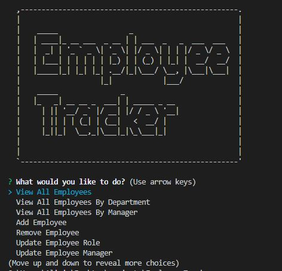

# Employee-Tracker

## Purpose
A command-line application to manage a company's employee database

## Built With
* Node.js
* Inquirer
* MySQL

## Demonstration video
[Video](./Demonstration_Employee-Tracker.mp4)

## GitHub Respository
https://github.com/designurhappy/Employee-Tracker

## Questions
* GitHub Username: designurhappy
* GitHub Link: https://github.com/designurhappy
* Email Address: beachgal0105@gmail.com
* Contact Instructions: Please email me for additional questions or call me at (805) 990-9977

 

 
